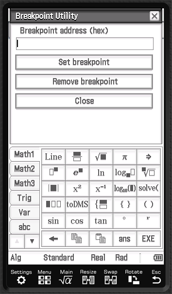
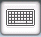
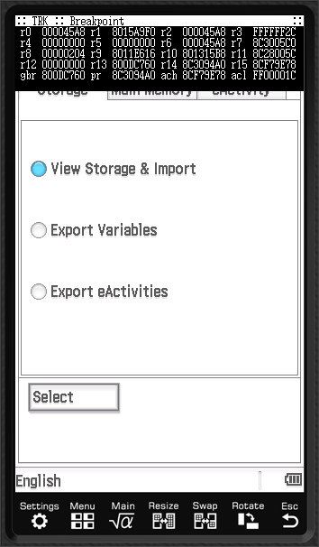

# Using TarRasK
> ⚠️ TRK is currently in early developpment, this doc may change
 
## Getting started

From your launcher, open the "TarrasK" program. 
The following GUI should display (still WiP):

There, you can enter ROM address to break on. 
This tool is particularly useful when trying to figure out what's the use of a subroutine
or even debug your own code !

First, you've to know that the ROM starts at `80000000` and you shouldn't mess with the headers.
To get more information about the classpad, please visit [the ClasspadDev](https://classpaddev.github.io).

As an advice, I'd recommend to get a copy of my IDA mapping of the rom,
or spin your favorite disassembler and get the addresses right !
That way, you could understand what's the rom doing and seeing it in action

> 🛈  The ROM addresses change between the versions. All the addresses in this documentation are mapped to the HollyHock's 02.01.2000 patched version. All the addresses are hex, except stated otherwise.

## Placing your first breakpoint

A safe place to place your first breakpoint is the "Select Keyboard Format" dialog, located at 
`801315B8`.

Enter in the "Breakpoint Utility" the address (always in hex, caps don't matter) and press "Set breakpoint"
If success, a message will print "Set!" into the input list.

You can now exit the program ("Close" or with pressing "Clear" button on the hardware keyboard) and click on the Keyboard icon in the preferences :

Doing so should trigger your breakpoint, displaying the following text :

You can see the values in the different register and once you're done you can resume execution with "Clear" hardware button.

> Note: You may have some UI glitches and missing LCD refreshes since it's doing display right in the middle of the execution stack
 
## Discarding existing breakpoint
You can remove breakpoint by going back to the "Breakpoint Utility" and entering the address, then pressing "Remove breakpoint".

If for some reasons you can't remember the address or can't disable it, you can try to press the "reset" button in the back of the calculator.
(It won't delete your files, just reset the memory and so remove the breakpoint)

