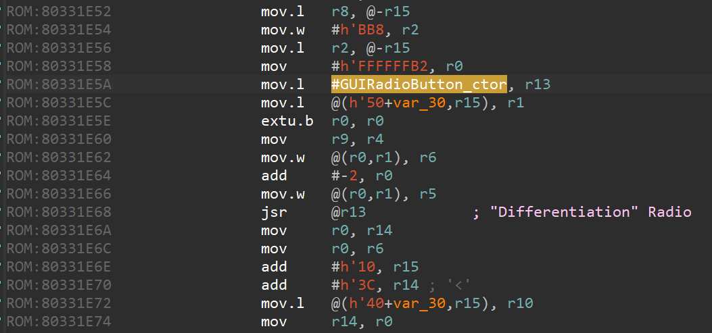
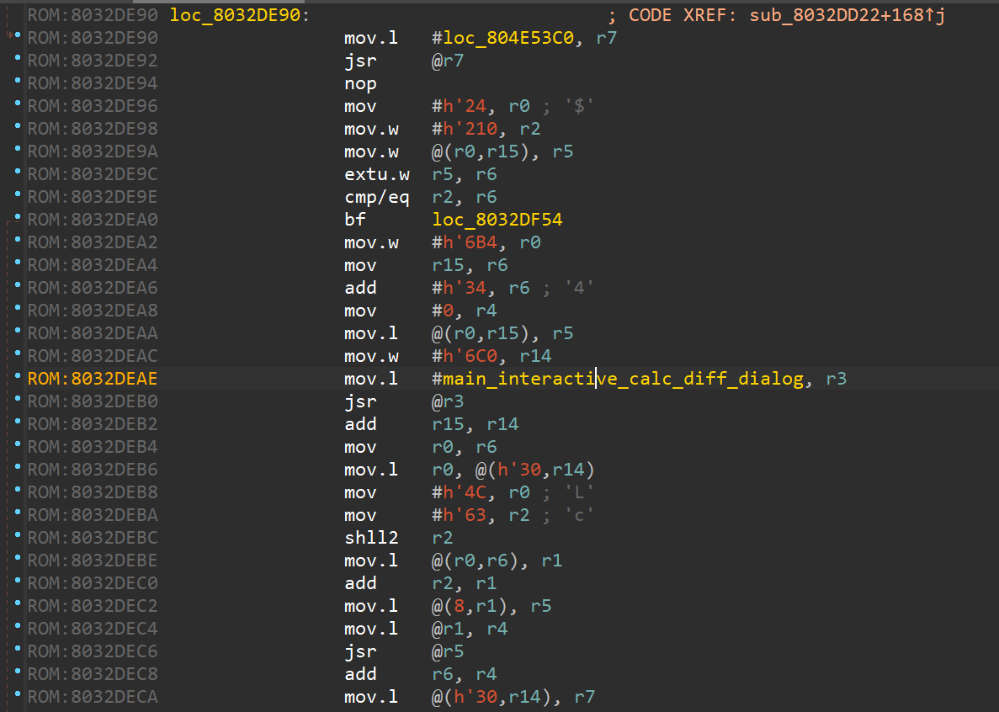
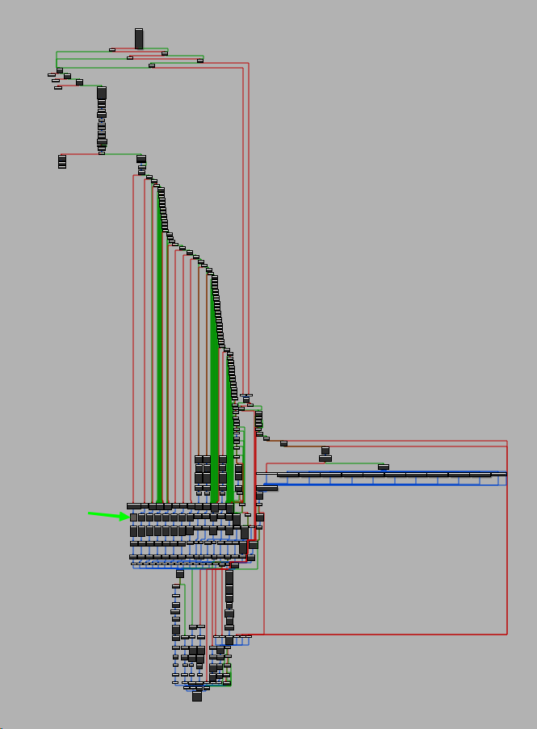
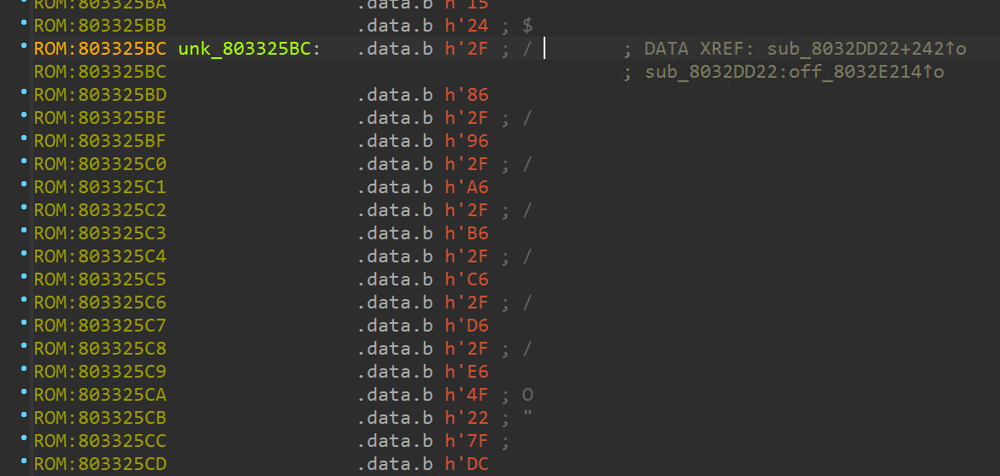
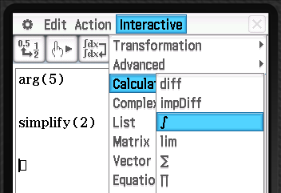

# Discovering ROM struct using breakpoint
> ⚠️ For now you can't disassemble the ROM with TarRasK.

I'd recommend having IDA open on your desktop since it's more comfortable to works with. 

You could use my IDA rom exploration project if you want to quickly start exploring !

## Prerequisites
You'll need the IDA Pro (or any Disassembly tool that's able to map the rom correctly) and your calculator with TarRasK installed. I'd recommend using a camera and filming the screen because it sometimes get really fast...

## Finding an entry
For this discovery, I'd use the `GUIRadioButton_ctor` SDK function.
We know from the SDK code that its address is `0x800F9964`, so we can place a breakpoint at this address using TarRasK.

Then, we need a target to trigger. I'd use the "Main > Interactive > calculation > Diff" dialog.

Go there, and it'll trigger two breakpoint, both having close address.
We're only interested in "`pr`" value, that should be `80331e6c`.

Switch back to IDA and press `g` to go to address, then enter `80331e6c`.

Scroll a bit up and press `c` to make IDA understand we're working with code.

If you mapped the SDK methods name to the ROM, you'll see the "`GUIRadioButton_ctor`" call with its arguments.

Scrolling up till the address `80331D98`, you'll see the `2F 86` bytes that's fairly common indicator of a subroutine.

I got most of them discovered by try-and-fail : pressing `c`, scrolling up till a `2F` maybe subroutine, pressing `p` to see if it maps to known subroutines and addresses, then ctrl-z'ing back and mapping the subroutine from the `2F` start.

Validate the subroutine back to your calculator by simply adding its address to a breakpoint.

If you've done correctly, you'll see another breakpoint dialog when opening the "*Main > Interactive > calculation > Diff*" dialog.

Take a note at the `pr` value, that should be `8032DEB4`.

> Note: For som reason (maybe my code's wrong, dunno) breakpoint sometimes won't work. Press the reset button at the back of the calculator and then place it again !

## Escalating from the dialog

Now that you known the subroutine, you can rename it using `N` key to something useful like "main_interactive_calc_diff_dialog" since it's a dialog opening from main view...

Then, jump using the `g` key to the `8032DEB4`. Once again press `c`, scroll a bit, press `c` and take a look.
You'd have some disassembly looking like this :

You can see your mapped subroutine being called.

At this point, we have to find the parent method.

The common easy method is to do so by trial-and-error:
- Scroll up with "page up" key or mouse scroll
- Press `c`
- See if it looks good, then scroll up
- Find a `2F` bloc that could be the subroutine start, then press `p` on it, or scroll up and redo this one more time

This little scrolling adventure should take you to `sub_8032DD22`. Once you're there, undo all your `c` code mapping with ctrl-z (while keeping the base address !) and then seek back with `g` to the `8032DD22` and press `p`.

## Getting the parent

It's time for some shinnies ! Since we're in the parent subroutine, we can press "space bar" key and watch the awesome graph :

The little green arrow is the location of our "`main_interactive_calc_diff_dialog`", what's cool is that we can now do neighbor discovery !

Zoom to this location and you'll see the block at right having the green text `unk_803325BC`. **UNK** mean that IDA did not know if it's data or code (assembly). Seek to that address with doubleclick.

As you see, the familiar "`2F`" mean it's very likely to be a subroutine. They are 3 bytes that are the most likely to mean subroutine in SH asm by experience, that are `2F`, `4F` and `7F`.

Press `p` and enjoy your new subroutine !

Now that we know something is happening there, we could test it by adding another breakpoint to this address. Open TarRasK and proceed.

## Tracing back the discovered subroutine 

Time's for the fun part, finding where this subroutine is called... 

First, I'd try to open the next menu entry : "*Main > Interactive > calculation > impDiff*".
But ... No breakpoint stacktrace opened. What did we do wrong ? Short answer: nothing. The graph view and logic isn't always reliable to the GUI view, just try other entries... 

The "integral" entry right after should give you the nice stacktrace we're waiting for ! Victory !

We can finally rename the subroutine `sub_803325BC` to something like "`main_interactive_calc_integral_dialog`"

> Note: the `pr` register on the stacktrace should point to `8032DF6A`. Tracing it back into IDA you'd see the actual calling loc we found earlier...
 
Browsing on IDA, the two top arrows are your best friend to get back to your previous location. 

## Getting all subroutines done

We can then call map the subroutines one-by-one, using the same technique...

Another way could be to actually call them from a freshly-compiled asm code, but that won't be discussed in this writeup (maybe another time, or with a cool LUA script if I find how to pass thought the compile errors)

